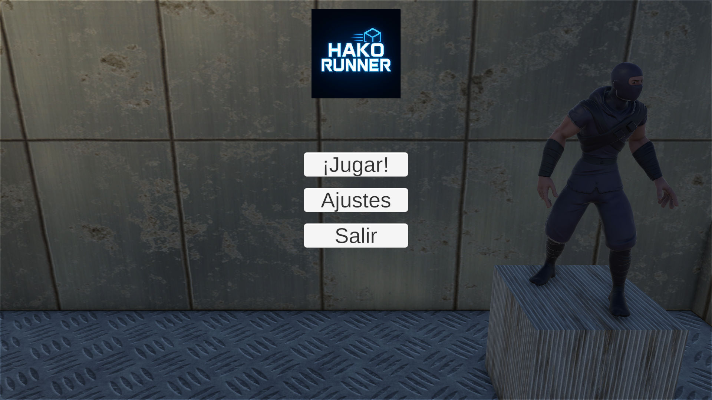
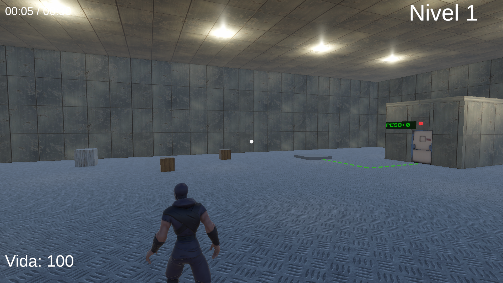
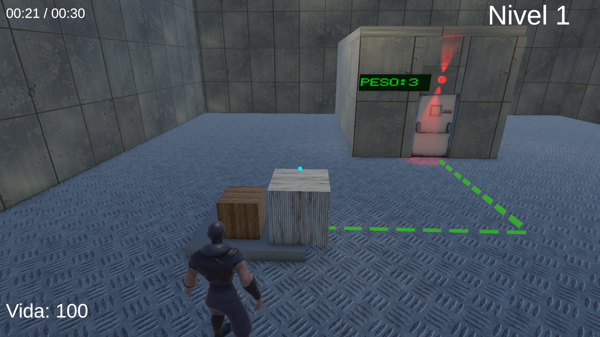
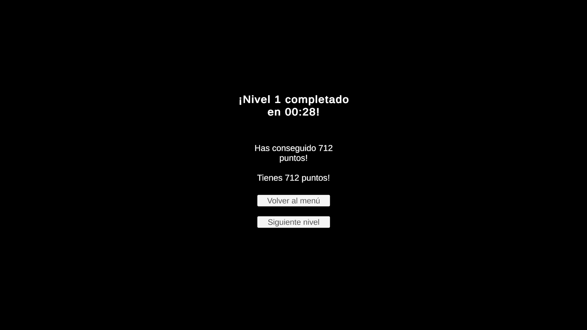

= 🚲 Hako Runner
Autor: Reyes Amador
:toc:
:icons: font
:source-highlighter: highlight.js
:github-link: https://github.com/ReyesAmador/HakoRunner

**Hako Runner** es un videojuego desarrollado en Unity como parte de un proyecto personal/educativo. El jugador debe _[resolver puzles mediante el uso de cajas, las deberá de coger y ponerlas en una báscula para llegar a un peso específico. Si el jugador llega al peso, que deberá de descubrir cuál es, se desbloqueará una puerta para avanzar al siguiente nivel. ]_.

== 🕹️ Características

* ✅ PRIMERA CARACTERÍSTICA : Mecánica de físicas con báscula
* ✅ SEGUNDA CARACTERÍSTICA : Ánimaciones de correr, andar y saltar.
* ✅ TERCERA CARACTERÍSTICA : Sonido de ambiente y efectos de partículas
* ✅ CUARTA CARACTERÍSTICA : Pantalla de carga con logo y splash screen

== 📷 Capturas de pantalla

[.text-center]

[.text-center]

[.text-center]

[.text-center]

== 📄 Documentación

Puedes consultar el Game Design Document (GDD) en el archivo link:GDD.pdf[GDD.pdf].

== 🛠️ Cómo jugar

. Descarga el archivo ZIP desde la sección link:{github-link}/releases[Releases]
. Extrae el contenido
. Ejecuta el archivo `.exe` correspondiente a tu sistema operativo

[NOTE]
====
No se requiere instalación adicional.
====

== 📦 Requisitos del sistema

=== Mínimos
* CPU: Intel Core i3 o equivalente
* RAM: 4 GB
* GPU: Intel HD Graphics 4000
* SO: Windows 10 / macOS 10.13
* Almacenamiento: 500 MB libres

=== Recomendados
* CPU: Intel Core i5 o superior
* RAM: 8 GB
* GPU: Nvidia GTX 1050 o equivalente
* SO: Windows 10 o superior
* Almacenamiento: 1 GB libres

== 📥 Descargar

Puedes descargar el juego desde la sección de link:{github-link}/releases[Releases].

== 🤝 Créditos

* *Desarrollador/a*: Reyes Amador Jurado
* *Assets de audio*: Chosic.com
* *Motor de juego*: https://unity.com[Unity]

